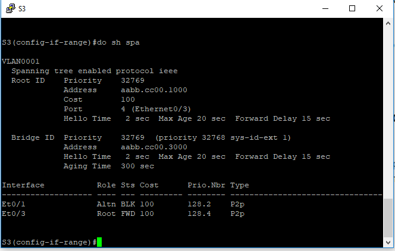

# Домашнее задание: Избыточность локальных сетей. STP

#### Цели занятия

Проанализировать протокол связующего дерева, назначение, функционирование и настройка STP.


Таблица адресации

| Устройство | Интерфейс | IP-адрес    | Маска подсети |
| ---------- | --------- | ----------- | ------------- |
| S1         | VLAN 1    | 192.168.1.1 | 255.255.255.0 |
| S2         | VLAN 1    | 192.168.1.2 | 255.255.255.0 |
| S3         | VLAN 1    | 192.168.1.3 | 255.255.255.0 |

Шаг 1:   Настройте базовые параметры каждого коммутатора.

a.   Отключите поиск DNS.

b.   Присвойте имена устройствам в соответствии с топологией.

c.   Назначьте **class** в качестве зашифрованного пароля доступа к привилегированному режиму.

d.   Назначьте **cisco** в качестве паролей консоли и VTY и активируйте вход для консоли и VTY каналов.

e.   Настройте logging synchronous для консольного канала.

f.   Настройте баннерное сообщение дня (MOTD) для предупреждения пользователей о запрете несанкционированного доступа.

g.   Задайте IP-адрес, указанный в таблице адресации для VLAN 1 на всех коммутаторах.

h.   Скопируйте текущую конфигурацию в файл загрузочной конфигурации.

[Конфигурации здесь](/Config)

Шаг 2:   Проверьте связь.

Проверьте способность компьютеров обмениваться эхо-запросами.

Успешно ли выполняется эхо-запрос от коммутатора S1 на коммутатор S2?   ____ДА__________

Успешно ли выполняется эхо-запрос от коммутатора S1 на коммутатор S3?   ____ДА__________

Успешно ли выполняется эхо-запрос от коммутатора S2 на коммутатор S3?   ____ДА__________

### Часть 1: Определение корневого моста

a.   Отключите все порты на коммутаторах.

```
S1-3(config)#interface range et0/0-3
S1-3(config-if-range)#shutdown
```

b.   Настройте подключенные порты в качестве транковых.

```
S1-3(config-if-range)#switchport mode trunk
```

c.   Включите порты F0/2 и F0/4 на всех коммутаторах.

```
S1-3(config)#interface range et0/1,et0/3

S1-3(config-if-range)#no shutdown
```

d.   Отобразите данные протокола spanning-tree.

S1-3#show spanning-tree


**Какой коммутатор является корневым мостом?** 

-S1

**Почему этот коммутатор был выбран протоколом spanning-tree в качестве корневого моста?**

-коммутатор с самым низким значением MAC-адреса становится корневым мостом, так как Bridge ID у всех одинаковый

**Какие порты на коммутаторе являются корневыми портами?** 

-S2 - порт eth0/1, s3 - порт et0/3

**Какие порты на коммутаторе являются назначенными портами?** 

-S1(et0/1, eth0/3) S2(eth0/3)

**Какой порт отображается в качестве альтернативного и в настоящее время заблокирован?** 

-S3 (eth0/1)

**Почему протокол spanning-tree выбрал этот порт в качестве невыделенного (заблокированного) порта?**

-Выбран в качестве альтернативного из-за стоимости пути


### Часть 2:   Наблюдение за процессом выбора протоколом STP порта, исходя из стоимости портов

При текущей конфигурации только один коммутатор может содержать заблокированный протоколом STP порт. Выполните команду **show spanning-tree** на обоих коммутаторах некорневого моста. В примере ниже протокол spanning-tree блокирует порт et0/1 на коммутаторе с самым высоким идентификатором BID (S3).



**a. Измените стоимость порта.**

Для наблюдения изменим стоимость корневого порта eth0/3

```
S3(config)#interface eth0/3
S3(config-if)#spanning-tree cost 99
```

Ранее заблокированный порт s3 - eth0/1 изменил роль на designated, а на коммутаторе S2-eth 0/3 порт стал альтернативным и в статусе заблокирован.


Отменил стоимость порта можно через команду

```
S3(config)#interface eth0/3
S3(config-if)# no spanning-tree cost
```

И все настройки вернулись в исходное состояние

### Часть 3:   Наблюдение за процессом выбора протоколом STP порта, исходя из приоритета портов

Включил порты на коммутаторах eth0/0 и eth 0/2


**Какой порт выбран протоколом STP в качестве порта корневого моста на каждом коммутаторе некорневого моста?** 

-S2 (eth0/0) S3(eth0/2)

**Почему протокол STP выбрал эти порты в качестве портов корневого моста на этих коммутаторах?**

-Priority number. Чем ниже номер приоритета порта, тем предпочтительнее считается порт в качестве корневого моста


##### **Вопросы для повторения**

1. **Какое значение протокол STP использует первым после выбора корневого моста, чтобы определить выбор порта?**

   -Сначала идет стоимость пути

2. **Если первое значение на двух портах одинаково, какое следующее значение будет использовать протокол STP при выборе порта?**

   -Если стоимости портов равны, процесс сравнивает BID.

3. **Если оба значения на двух портах равны, каким будет следующее значение, которое использует протокол STP при выборе порта?**

   -Если стоимость пути и  BID равны, для определения корневого моста используются приоритеты портов.