# **Lab - Implement DHCPv4**


#### Topology

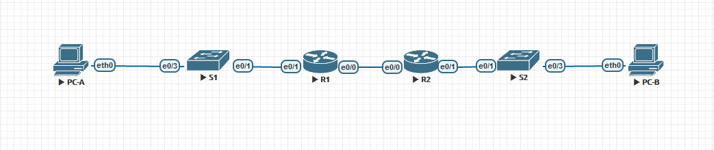

#### Addressing Table

| Device | Interface  | IP Address   | Subnet Mask     | Default Gateway |
| ------ | ---------- | ------------ | --------------- | --------------- |
| R1     | e0/0       | 10.0.0.1     | 255.255.255.252 | N/A             |
| R1     | e0/1       | N/A          | N/A             | N/A             |
| R1     | e0/1.100   | 192.168.1.1  | 255.255.255.192 | N/A             |
| R1     | e0/1..200  | 192.168.1.65 | 255.255.255.224 | N/A             |
| R1     | e0/1..1000 | N/A          | N/A             | N/A             |
| R2     | e0/0       | 10.0.0.2     | 255.255.255.252 | N/A             |
| R2     | e0/1       | 192.168.1.97 | 255.255.255.240 | N/A             |
| S1     | VLAN 200   | 192.168.1.66 | 255.255.255.224 | 192.168.1.65    |
| S2     | VLAN 1     | 192.168.1.98 | 255.255.255.240 | 192.168.1.97    |
| PC-A   | NIC        | DHCP         | DHCP            | DHCP            |
| PC-B   | NIC        | DHCP         | DHCP            | DHCP            |

#### VLAN Table

| VLAN | Name        | Interface Assigned |
| ---- | ----------- | ------------------ |
| 1    | N/A         | S2: e0/3           |
| 100  | Clients     | S1: e0/3           |
| 200  | Management  | S1: VLAN 200       |
| 999  | Parking_Lot | S1: F0/0, F0/2     |
| 1000 | Native      | N/A                |

[Конфигурации](https://github.com/Krestok/otus-networks/tree/master/homework005DHCPv4/Config)

#### Часть 1: Establish an addressing scheme

Subnet the network 192.168.1.0/24 to meet the following requirements:

a.   One subnet, “Subnet A”, supporting 58 hosts (the client VLAN at R1).

Subnet A:	192.168.1.0/26

broadcast:	192.168.1.63/26

IP адрес первого хоста: 192.168.1.1

IP адрес последнего хоста: 192.168.1.62

Record the first IP address in the Addressing Table for R1   e0/1.100 . Record the second IP address in the Address Table for S1 VLAN 200 and enter the associated default gateway.


b.   One subnet, “Subnet B”, supporting 28 hosts (the management VLAN at R1). 

Subnet B:	192.168.1.64/27

broadcast:	192.168.1.95/27

IP адрес первого хоста: 192.168.1.65

IP адрес последнего хоста: 192.168.1.94

Record the first IP address in the Addressing Table for R1   e0/1.200. Record the second IP address in the Address Table for S1 VLAN 1 and enter the associated default gateway.


c.   One subnet, “Subnet C”, supporting 12 hosts (the client network at R2).

Subnet C:	192.168.1.96/28

broadcast:	192.168.1.111

IP адрес первого хоста: 192.168.1.97

IP адрес последнего хоста: 192.168.1.110

Record the first IP address in the Addressing Table for R2  e0/1.


#### Часть 2. Настройка меж-VLAN маршрутизации на R1

a.	Activate interface G0/0/1 on the router.

```
R1(config)#interface e0/1
R1(config-if)#no shutdown
```

b.   Configure sub-interfaces for each VLAN as required by the IP addressing table. All sub-interfaces use 802.1Q encapsulation and are assigned the first usable address from the IP address pool you have calculated. Ensure the sub-interface for the native VLAN does not have an IP address assigned. Include a description for each sub-interface.

```
R1(config)#interface e0/1.100
R1(config-subif)#encapsulation dot1Q 100
R1(config-subif)#ip address 192.168.1.1 255.255.255.192
R1(config-subif)#interface e0/1.200
R1(config-subif)#encapsulation dot1Q 200
R1(config-subif)#ip address 192.168.1.65 255.255.255.224
R1(config-subif)#interface e0/1.1000
R1(config-subif)#encapsulation dot1Q 1000 native
```

c.   Verify the sub-interfaces are operational.


#### Часть 3: Configure G0/0/1 on R2, then G0/0/0 and static routing for both routers

a.   Configure G0/0/1 on R2 with the first IP address of Subnet C you calculated earlier.

```
R2(config)#interface e0/1
R2(config-if)#ip address 192.168.1.97 255.255.255.240
```

b.   Configure interface G0/0/0 for each router based on the IP Addressing table above.

```
R1(config)#interface e0/0
R1(config-if)#ip address 10.0.0.1 255.255.255.252

R2(config)#interface e0/0
R2(config-if)#ip address 10.0.0.2 255.255.255.252
```

c.   Configure a default route on each router pointed to the IP address of G0/0/0 on the other router.

```
R1(config)#ip route 0.0.0.0 0.0.0.0 10.0.0.2

R2(config)#ip route 0.0.0.0 0.0.0.0 10.0.0.1
```

d.   Verify static routing is working by pinging R2’s G0/0/1 address from R1.

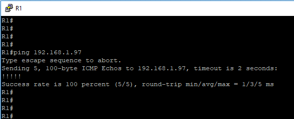

e.   Save the running configuration to the startup configuration file.

```
R1#copy running-config startup-config
Destination filename [startup-config]?
Building configuration...
[OK]

R2#copy running-config startup-config
Destination filename [startup-config]?
Building configuration...
[OK]
```

#### Часть 4: Create VLANs on S1.

**Note**: S2 is only configured with basic settings.

a.   Create and name the required VLANs on switch 1 from the table above.

```
S1(config)#vlan 100
S1(config-vlan)#name Clients
S1(config-vlan)#vlan 200
S1(config-vlan)#name Management
S1(config-vlan)#vlan 999
S1(config-vlan)#name Parking Lot
S1(config-vlan)#vlan 1000
S1(config-vlan)#name Native
```

b.   Configure and activate the management interface on S1 (VLAN 200) using the second IP address from the subnet calculated earlier. Additionally, set the default gateway on S1.

```
S1(config)#inter vlan 200
S1(config-if)#ip address 192.168.1.66 255.255.255.224
S1(config-if)#no shutdown
S1(config)#ip default-gateway 192.168.1.65
```

c.   Configure and activate the management interface on S2 (VLAN 1) using the second IP address from the subnet calculated earlier. Additionally, set the default gateway on S2

```
S2(config)#interface vlan 1
S2(config-if)#ip address 192.168.1.98 255.255.255.240
S2(config)#ip default-gateway 192.168.1.97
```

d.   Assign all unused ports on S1 to the Parking_Lot VLAN, configure them for static access mode, and administratively deactivate them. On S2, administratively deactivate all the unused ports.

```
S1(config)#interface range e0/0,e0/2
S1(config-if-range)#switchport mode access
S1(config-if-range)#switchport access vlan 999
S1(config-if-range)#shutdown

S2(config)#inter range e0/0,e0/2
S2(config-if-range)#switchport mode access
S2(config-if-range)#switchport access vlan 999
S2(config-if-range)#shutdown
```

**Note**: The interface range command is helpful to accomplish this task with as few commands as necessary.


#### Часть 5: Assign VLANs to the correct switch interfaces.

a.   Assign used ports to the appropriate VLAN (specified in the VLAN table above) and configure them for static access mode.

```
S2(config)#inter e0/3
S2(config-if)#switchport mode access
S2(config-if)#switchport access vlan 1

S1(config)#inter e0/3
S1(config-if)#switchport mode access
S1(config-if)#switchport access vlan 100
```


b.   Verify that the VLANs are assigned to the correct interfaces.

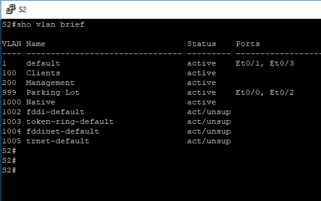

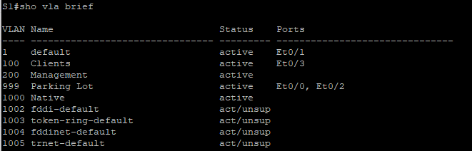


### Часть 6: Manually configure S1’s interface e0/1 as an 802.1Q trunk.

a.   Change the switchport mode on the interface to force trunking.

b.   As a part of the trunk configuration, set the native VLAN to 1000.

c.   As another part of trunk configuration, specify that VLANs 100, 200, and 1000 are allowed to cross the trunk.

```
S1(config)#interface e0/1
S1(config-if)#switchport trunk encapsulation dot1q
S1(config-if)#switchport mode trunk
S1(config-if)#switchport trunk allowed vlan 100,200,1000
S1(config-if)#switchport trunk native vlan 1000
```

d.   Save the running configuration to the startup configuration file.

e.   Verify trunking status.

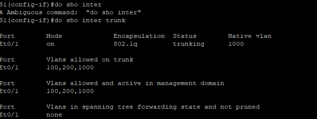

#### Question:

At this point, what IP address would the PC’s have if they were connected to the network using DHCP?

169.254.212.152


#### Часть 7: Configure R1 with DHCPv4 pools for the two supported subnets. Only the DHCP Pool for subnet A is given below

a.   Exclude the first five useable addresses from each address pool.

```
R1(config)#ip dhcp excluded-address 192.168.1.1 192.168.1.5
R1(config)#ip dhcp excluded-address 192.168.1.97 192.168.1.101
```

b.   Create the DHCP pool (Use a unique name for each pool).

c.   Specify the network that this DHCP server is supporting.

d.   Configure the domain name as ccna-lab.com

e.   Configure the appropriate default gateway for each DHCP pool.

f.   Configure the lease time for 2 days 12 hours and 30 minutes.

```
R1(config)#ip dhcp pool vlan100
R1(dhcp-config)# network 192.168.1.0 255.255.255.192
R1(dhcp-config)# default-router 192.168.1.1
R1(dhcp-config)# domain-name ccna-lab.com
R1(dhcp-config)#lease 2 12 30
```

g.   Next, configure the second DHCPv4 Pool using the pool name R2_Client_LAN and the calculated network, default-router and use the same domain name and lease time from the previous DHCP pool.

```
R1(config)#ip dhcp pool R2_Client_Lan
R1(dhcp-config)# network 192.168.1.96 255.255.255.240
R1(dhcp-config)# default-router 192.168.1.97
R1(dhcp-config)# domain-name ccna-lab.com
R1(dhcp-config)#lease 2 12 30
```

### Часть 8: Verify the DHCPv4 Server configuration

a.   Issue the command **show ip dhcp pool** to examine the pool details.

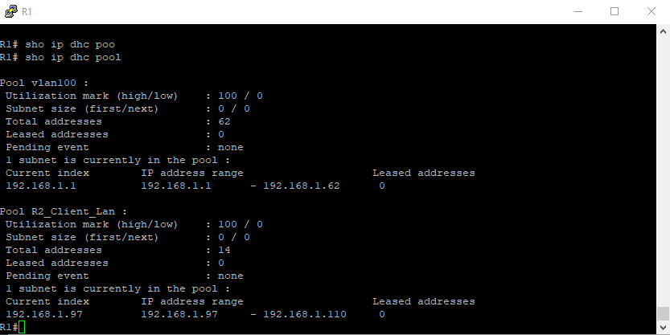

b.   Issue the command **show ip dhcp bindings** to examine established DHCP address assignments.

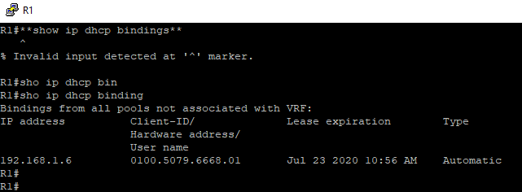

c.   Issue the command **show ip dhcp server** **statistics** to examine DHCP messages.

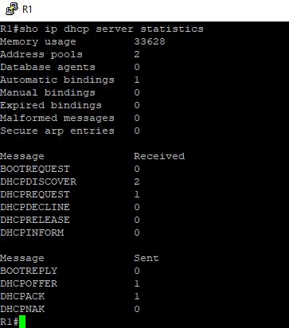

### Часть 9: Attempt to acquire an IP address from DHCP on PC-A

a.   Open a command prompt on PC-A and issue the command **ipconfig /renew**.

b.   Once the renewal process is complete, issue the command **ipconfig** to view the new IP information.


c.   Test connectivity by pinging R1’s G0/0/1 interface IP address.

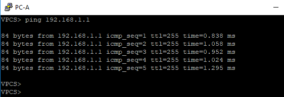

### Часть 10: Configure R2 as a DHCP relay agent for the LAN on G0/0/1

a.   Configure the **ip helper-address** command on G0/0/1 specifying R1’s G0/0/0 IP address.

```
R2(config)#interface e0/1
R2(config-if)#ip helper-address 10.0.0.1
```

b.   Save your configuration.

### Часть 11: Attempt to acquire an IP address from DHCP on PC-B

a.   Open a command prompt on PC-B and issue the command **ipconfig /renew**.

b.   Once the renewal process is complete, issue the command **ipconfig** to view the new IP information.

c.   Test connectivity by pinging R1’s G0/0/1 interface IP address.

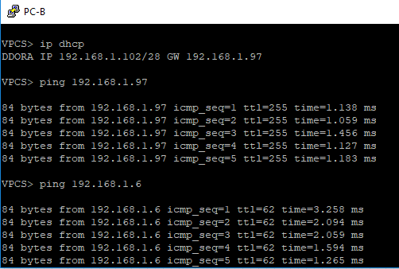

d.   Issue the **show ip dhcp binding** on R1 to verify DHCP bindings.

e.   Issue the **show ip dhcp server statistics** on R1 and R2 to verify DHCP messages.

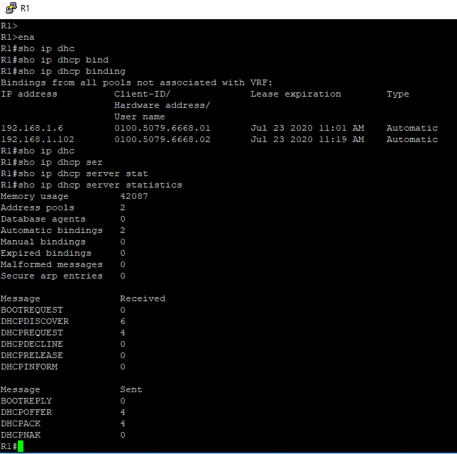