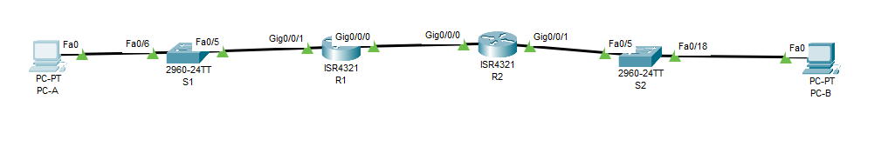
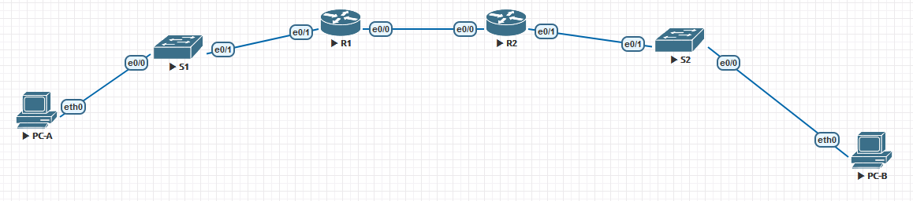

# **Lab - Configure DHCPv6**

#### Topology





#### Addressing Table

| Device | Interface      | IPv6 Address           |
| ------ | -------------- | ---------------------- |
| R1     | G0/0/0  (e0/0) | 2001:db8:acad:2::1 /64 |
| R1     | G0/0/0  (e0/0) | fe80::1                |
| R1     | G0/0/1  (e0/1) | 2001:db8:acad:1::1/64  |
| R1     | G0/0/1  (e0/1) | fe80::1                |
| R2     | G0/0/0  (e0/0) | 2001:db8:acad:2::2/64  |
| R2     | G0/0/0  (e0/0) | fe80::2                |
| R2     | G0/0/1  (e0/1) | 2001:db8:acad:3::1 /64 |
| R2     | G0/0/1  (e0/1) | fe80::1                |
| PC-A   | NIC            | DHCP                   |
| PC-B   | NIC            | DHCP                   |

[Конфигурации](https://github.com/Krestok/otus-networks/tree/master/homework005DHCPv6/Config)

#### Step 1: Configure interfaces and routing for both routers.

a.   Configure the G0/0/0 and G0/0/1 interfaces on R1 and R2 with the IPv6 addresses specified in the table above.   Enable IPv6 Routing.

```
R1(config)#ipv6 unicast-routing
R1(config-if)#interface g0/0/0
R1(config-if)#ipv6 address 2001:db8:acad:2::1/64
R1(config-if)#ipv6 address fe80::1 link-local 
R1(config-if)#no shutdown
R1(config-if)#interface g0/0/1
R1(config-if)#ipv6 address 2001:db8:acad:1::1/64
R1(config-if)#ipv6 address fe80::1 link-local 
R1(config-if)#no shutdown

R2(config)#ipv6 unicast-routing
R2(config)#interface g0/0/0
R2(config-if)#ipv6 address 2001:db8:acad:2::2/64
R2(config-if)#ipv6 address fe80::2 link-local
R2(config-if)#no shutdown
R2(config-if)#interface g0/0/1
R2(config-if)#ipv6 address 2001:db8:acad:3::1/64
R2(config-if)#ipv6 address fe80::1 link-local 
R2(config-if)#no shutdown
```

b.   Configure a default route on each router pointed to the IP address of G0/0/0 on the other router.

```
R1(config)#ipv6 route ::/0 2001:db8:ACAD:2::2
R2(config)#ipv6 route ::/0 2001:db8:ACAD:2::1
```

c.   Verify routing is working by pinging R2’s G0/0/1 address from R1


d.   Save the running configuration to the startup configuration file.

#### Step 2: Verify SLAAC Address Assignment from R1

In Part 2, you will verify that Host PC-A receives an IPv6 address using the SLAAC method.

Power PC-A up and ensure that the NIC is configured for IPv6 automatic configuration.

After a few moments, the results of the command **ipconfig** should show that PC-A has assigned itself an address from the 2001:db8:1::/64 network.


**Question:**

Where did the host-id portion of the address come from?

From EUI64(part of mac address)

#### Step 3: Configure and Verify a DHCPv6 server on R1

**Configure R1 to provide stateless DHCPv6 for PC-A.**

a.   Create an IPv6 DHCP pool on R1 named R1-STATELESS. As a part of that pool, assign the DNS server address as 2001:db8:acad::1 and the domain name as stateless.com.

Open configuration window

```
R1(config)# ipv6 dhcp pool R1-STATELESS
R1(config-dhcp)# dns-server 2001:db8:acad::1
R1(config-dhcp)# domain-name STATELESS.com
```

b.   Configure the G0/0/1 interface on R1 to provide the OTHER config flag to the R1 LAN, and specify the DHCP pool you just created as the DHCP resource for this interface.

```
R1(config)# interface g0/0/1
R1(config-if)# ipv6 nd other-config-flag
R1(config-if)# ipv6 dhcp server R1-STATELESS
```

c.   Save the running configuration to the startup configuration file.

Close configuration window

d.   Restart PC-A.

e.   Examine the output of **ipconfig /all** and notice the changes.


f.   Test connectivity by pinging R2’s G0/0/1 interface IP address.


#### Step 4: Configure a stateful DHCPv6 server on R1

In Part 4, you will configure R1 to respond to DHCPv6 requests from the LAN on R2.

a.   Create a DHCPv6 pool on R1 for the 2001:db8:acad:3:aaaa::/80 network. This will provide addresses to the LAN connected to interface G0/0/1 on R2. As a part of the pool, set the DNS server to 2001:db8:acad::254, and set the domain name to STATEFUL.com.

Open configuration window

```
R1(config)# ipv6 dhcp pool R2-STATEFUL
R1(config-dhcp)# address prefix 2001:db8:acad:3:aaa::/80
R1(config-dhcp)# dns-server 2001:db8:acad::254
R1(config-dhcp)# domain-name STATEFUL.com
```

b.   Assign the DHCPv6 pool you just created to interface g0/0/0 on R1.

```
R1(config)# interface g0/0/0
R1(config-if)# ipv6 dhcp server R2-STATEFUL
```

**Power on PC-B and examine the SLAAC address that it generates.**


in the output that the prefix used is 2001:db8:acad:3::

#### Step 5: Configure R2 as a DHCP relay agent for the LAN on G0/0/1.

a.   Configure the **ipv6 dhcp relay** command on R2 interface G0/0/1, specifying the destination address of the G0/0/0 interface on R1. Also configure the **managed-config-flag** command.

Open configuration window

```
R2(config)# interface g0/0/1
R2(config-if)# ipv6 nd managed-config-flag
R2(config-if)# ipv6 dhcp relay destination 2001:db8:acad:2::1 g0/0/0
```

b.   Save your configuration.

Close configuration window

#### Step 6: Attempt to acquire an IPv6 address from DHCPv6 on PC-B.

a.   Restart PC-B.

a.   Open a command prompt on PC-B and issue the command **ipconfig /all** and examine the output to see the results of the DHCPv6 relay operation.


b.   Test connectivity by pinging R1’s G0/0/1 interface IP address.

